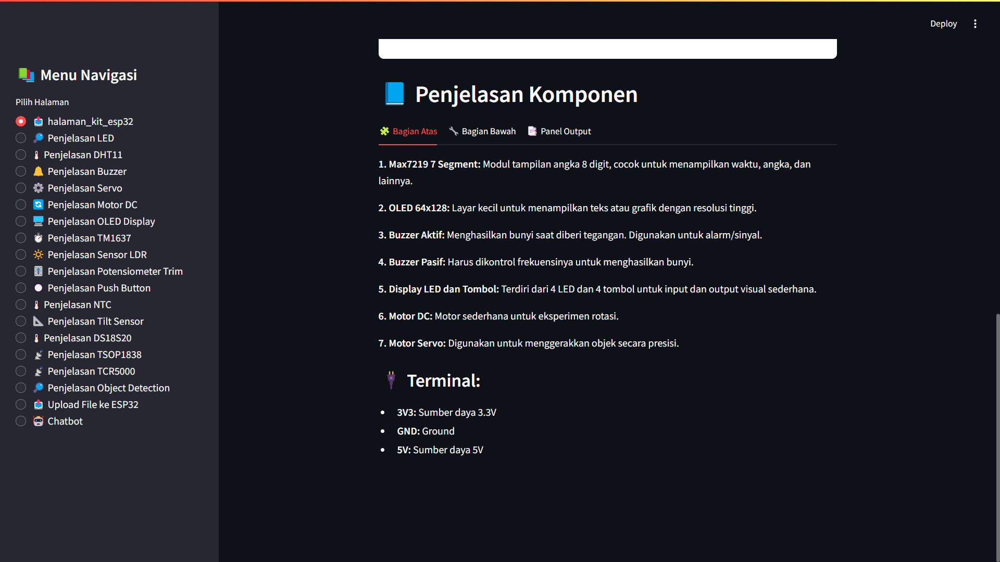

# 💡 EduKit Web App + ESP32 + ESP32-CAM

Aplikasi edukatif berbasis **web** (Streamlit) yang terhubung dengan **ESP32** dan **ESP32-CAM** untuk pembelajaran sensor, aktuator, serta pemrograman mikrokontroler secara interaktif.

<p align="center">
  
</p>

---

## 📚 Fitur Aplikasi Web (Streamlit)

Setiap halaman membahas 1 topik sensor atau aktuator:

### 🧠 Edukasi & Simulasi Komponen
- 📥 **Pengenalan Kit ESP32** (`halaman_kit_esp32.py`)
- 💡 **LED**
- 🔔 **Buzzer**
- 🌡️ **DHT11**
- ⚙️ **Servo Motor**
- 🔄 **Motor DC**
- 🖥️ **OLED Display**
- ⏱️ **TM1637 (7-segment)**
- 🔆 **Sensor LDR**
- 🎚 **Potensiometer Trim**
- 🔘 **Push Button**
- 🌡 **NTC Thermistor**
- 🌡 **DS18S20**
- 🎯 **Tilt Sensor**
- ⚫ **TCRT5000 (sensor garis)**
- 📡 **TSOP1838 (IR receiver)**
- 👤 **Login**
- 🧠 **Quiz Challenge**
- 📜 **History Quiz**

### 🤖 AI & IoT
- 🔍 **Object Detection (AI)** – dengan model Roboflow (`halaman_deteksi_sensor_dan_penjelasan.py`)
- 📤 **Upload Program ke ESP32** – langsung dari web (`halaman_upload_file.py`)
- 💬 **Chatbot AI** – rekomendasi sensor & tanya jawab otomatis (`halaman_chatbot.py`)

---

## 🛠️ Teknologi yang Digunakan

- **Python**, **Streamlit** – Web frontend
- **OpenCV**, **gTTS**, **pygame**
- **Roboflow Inference SDK** – deteksi objek AI
- **Google Gemini API** – chatbot AI
- **ESP32** + MicroPython – kontrol sensor
- **ESP32-CAM** – pengambilan gambar real-time via HTTP server

---

## 🚀 Cara Menjalankan Web App (Streamlit)

### 1. Clone Project

```bash
git clone https://github.com/username/edukit-web-app.git
cd edukit-web-app
```

### 2. Install Dependencies

```bash
pip install -r requirements.txt
```

### 3. Jalankan Aplikasi

```bash
streamlit run app.py
```

---

## 🌐 MicroPython: ESP32 `main.py`

Program `main.py` diupload ke ESP32 untuk:
- Tampilkan IP WiFi di OLED
- Terima file `.py` dari web
- Eksekusi otomatis file hasil upload (`uploaded.py`)

### 💾 File Utama
```python
# Fungsi utama ESP32 (MicroPython)
- Connect WiFi
- Start Web Server port 8080
- Terima file .py dari web app (via POST /upload)
- Simpan sebagai uploaded.py lalu jalankan otomatis
- Tampilkan status di OLED (sukses/gagal)
```

> Simpan sebagai `main.py` dan upload ke ESP32 via Thonny / uPyCraft / WebREPL.

---

## 📸 ESP32-CAM HTTP Server

Program terpisah untuk **ESP32-CAM** untuk streaming gambar JPEG:

### 📋 Fitur
- Tersambung ke WiFi
- Inisialisasi kamera
- Menyediakan server HTTP port 8080
- Kirim gambar JPEG saat ada request HTTP GET

### 🔁 Alur
```python
- connect_wifi()
- init_camera()
- start_http_server()
```

> Simpan sebagai script dan upload ke ESP32-CAM. Akses melalui browser `http://<ip-esp32-cam>:8080` untuk ambil gambar JPEG.

---

## 📁 Struktur Proyek

```
edukit-web-app/
├── app.py                      # Main Streamlit App
├── requirements.txt
├── README.md
├── utils.py
├── halaman_kit_esp32.py
├── halaman_led.py
├── halaman_buzzer.py
├── halaman_dht11.py
├── halaman_servo.py
├── halaman_motor_dc.py
├── halaman_oled.py
├── halaman_tm1637.py
├── halaman_ldr.py
├── halaman_trim.py
├── halaman_button.py
├── halaman_ntc.py
├── halaman_ds18s20.py
├── halaman_tilt.py
├── halaman_tcrt5000.py
├── halaman_tsop1838.py
├── halaman_deteksi_sensor_dan_penjelasan.py
├── halaman_upload_file.py
├── halaman_chatbot.py
├── halaman_history_quiz.py
├── halaman_quiz.py
├── halaman_login.py
├── assets/                   # Gambar sensor/komponen
└── micropython/
    ├── main.py              # Untuk ESP32 (WiFi, OLED, Upload .py)
    └── camera_server.py     # Untuk ESP32-CAM (stream JPEG)
```

---

## ⚠️ Catatan Penting

- Pastikan semua dependensi Python sudah terinstall (`requirements.txt`)
- Sambungkan ESP32 ke WiFi sebelum upload file
- Untuk fitur AI Chatbot, pastikan kamu punya API Key dari [Google Gemini](https://aistudio.google.com/app/apikey)
- Untuk ESP32-CAM, gunakan board `AI-Thinker ESP32-CAM` dan kamera OV2640

---

## 👨‍💻 Anggota

- **Rahsya Benova Akbar** – Fullstack AIoT Engineer
- **Raffa Eka Prayoga** - Hardware Engineer
- **Muhammad Ghaitsa Geanoveffa** - System Designer
- **Wildan Fathan** - Data Analyst
